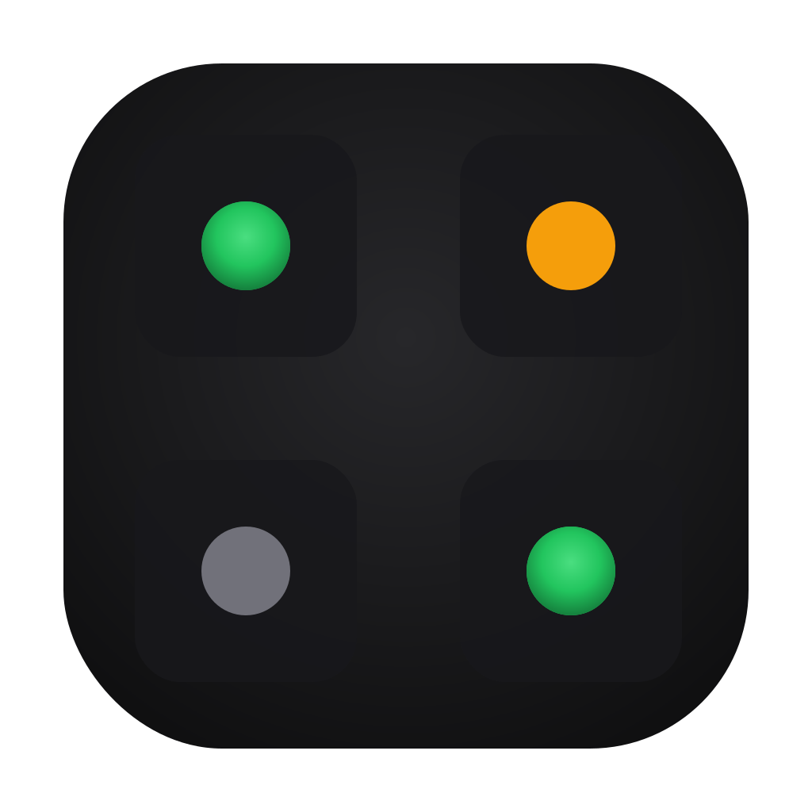
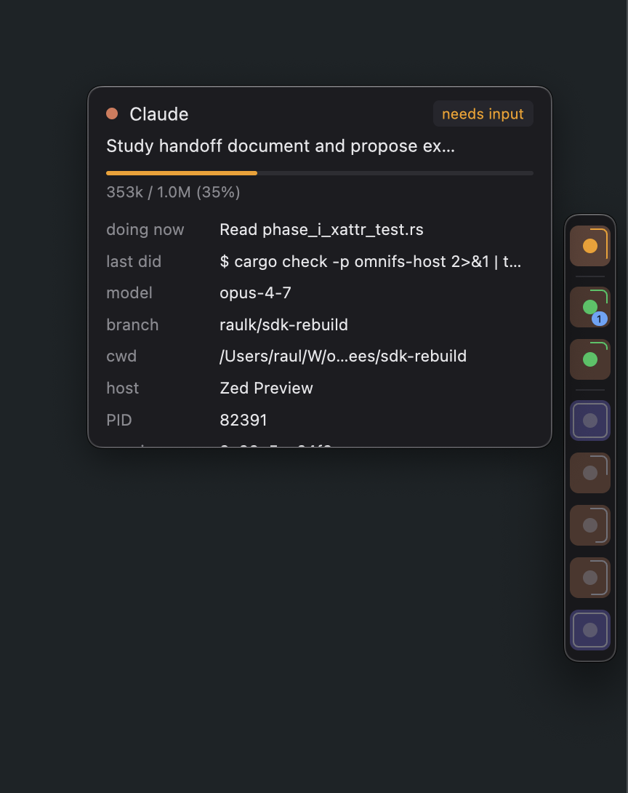

<p align="center">
  
</p>

<h1 align="center">Corral</h1>

<p align="center">
  <em>Clankers, neatly corralled at the edge of your screen.</em><br>
  A tiny macOS status strip for the Claude Code and Codex agents running on your machine.
</p>

<p align="center">
  <a href="https://github.com/raulk/corral/actions/workflows/ci.yml"></a>
  <a href="https://github.com/raulk/corral/actions/workflows/release.yml"></a>
  
  
</p>

<p align="center">
  <a href="https://github.com/raulk/corral/releases/latest">
    
  </a>
</p>

<p align="center">
  
</p>

Corral watches local Claude Code and Codex sessions, tracks their live lifecycle,
and gives you a compact always-on-top strip of agent state. Click an agent tile
to jump back to the terminal tab that owns it.

## What it does

- Discovers live Claude Code and Codex CLI sessions from local process state.
- Binds each process to its transcript under `~/.claude/projects` or
  `~/.codex/sessions`, using Claude's per-process session record when
  available.
- Tracks whether an agent is active, idle, waiting for input, awaiting a
  structured answer, or closed.
- Shows model, branch, context usage, current action, host app, session id, and
  transcript path in hover details.
- Focuses the owning terminal tab for Terminal.app, iTerm2, and Ghostty, with a
  generic app-focus fallback for other terminal emulators.
- Emits typed trace events for the integration harness.

## Status model

| State | Signal |
| --- | --- |
| Active | The agent is mid-turn or has recent transcript activity. |
| Awaiting answer | The agent is blocked on a structured human question, detected from transcript events or Claude's live session record. |
| Needs input | The last turn ended and the agent is ready for another prompt. |
| Idle | The session has gone quiet past the idle threshold. |
| Closed | The tracked process exited. |

## Requirements

- macOS 13 Ventura or later.
- Apple Silicon arm64.
- Claude Code and/or Codex installed and running locally.
- Automation permission for terminal focus features. macOS prompts on first
  AppleScript access to Terminal.app, iTerm2, or Ghostty.

Corral is intentionally not a Mac App Store app. Its discovery model depends on
local process inspection and open transcript files, which do not fit the App
Store sandbox.

Current local testing has covered:

| Tool | Version |
| --- | --- |
| Claude Code | 2.1.140 |
| Codex CLI | 0.130.0 |
| Ghostty | 1.3.1 |

## Install

Download the latest Apple Silicon build from the
[GitHub releases page](https://github.com/raulk/corral/releases/latest).
Corral does not have a signed public release yet, so release DMGs are unsigned.

For local use:

```sh
just unsigned-dmg
open target/Corral.dmg
```

Unsigned builds require normal Gatekeeper bypass handling.

Once a Developer ID certificate exists, the signed release path is:

```sh
just release
just release-sha
```

## Develop

```sh
just check
just run
```

Useful recipes:

| Command | Purpose |
| --- | --- |
| `just run` | Run the app directly from Cargo. |
| `just app` | Build `target/app/Corral.app`. |
| `just unsigned-dmg` | Build an unsigned arm64 DMG for draft testing. |
| `just release` | Build, sign, notarize, and staple a release DMG. |
| `just changelog 0.1.0` | Prepend unreleased Conventional Commit changes to `CHANGELOG.md`. |
| `just release-sha` | Print the DMG SHA-256 for release notes or a Cask. |

## Test

```sh
cargo fmt --all -- --check
cargo clippy --workspace --all-targets -- -D warnings
cargo nextest run --workspace
```

The integration harness lives in `tests/` and drives real agents plus real
terminal emulators:

```sh
cd tests
bun run tests
```

The harness is macOS-only and needs the relevant CLIs and terminal apps on the
machine.

## Release workflow

The `Release` GitHub Actions workflow is modeled after a Zed-style draft release
pipeline:

1. Push a `v<version>` tag.
2. Update `CHANGELOG.md` on `main` with git-cliff.
3. Create or reuse a draft `v<version>` release with git-cliff release notes.
4. Run validation.
5. Build the arm64 unsigned DMG.
6. Upload the DMG and `SHA256SUMS`.
7. Validate that the draft release contains exactly the expected assets.

The normal release trigger is:

```sh
git tag v0.1.0
git push origin v0.1.0
```

`just changelog <version>` remains available for local preview or manual
maintenance. GitHub Releases and `CHANGELOG.md` use the same git-cliff
configuration.

Publishing the draft remains a manual decision.

## Repository layout

```text
crates/corral-core      Process, transcript, registry, and trace plumbing
crates/corral-adapters  Terminal focus adapters
crates/corral-app       GPUI app and strip UI
tests/                  End-to-end harness for live agents and terminals
```
